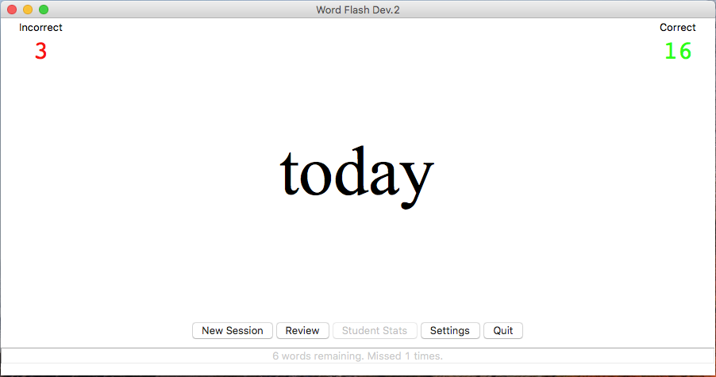

# Word Flash
> A simple flash card style study tool I created to help my daughter
learn to read.

### *New Python developers are welcome and encouraged to contribute to this project!*

### Features
- 38 word lists with 1174 sight words and phonics combinations
- Flash card style interface
- Student progress tracking
- Fully customizable Word Lists

*Planned Features*
- Support for multiple students
- Student progress & trend analysis
- Dynamic Word List creation based on student progress

### How to Use Word Flash
Select the New Session button to start a study session. The first
word from the active word lists will be shown. After the student
attempts to read the word, press the Right Arrow key to register 
a correct answer, and the Left Arrow key for an incorrect 
answer. One point will be added to either the Correct or Incorrect
score.

Pressing either the Right or Left Arrow key will advance to the 
next word in the list. You cannot go back to a previous word.

After the last word is displayed, "All done!" will be shown on
the screen. If the student missed any words, the Review button
will be activated. Selecting the Review button will allow the
student to try the words they missed again.

### Settings
Standard settings can be changed in the Settings window. Click
the Settings button in the main window to open the Settings
window.

Activate and deactivate the word lists and options you want to
use by selecting or clearing the check mark next to each option.
When you click "Okay", all changes will be made. If you change
you mind, you can cancel your changes by simply clicking the
close (X) button of the Settings window.

***NOTE:** You must restart Word Flash to show or hide the Score
Board or Status Bar. A bug issue has been created.*

### Advanced Customization
You can make changes to the standard Word Lists and even add your
own customized Word Lists by editing the word_flash.ini file.
You'll want to be very careful when making changes. If any of the
original entries are changed, Word Flash will likely fail to
operate correctly. Before making any changes it is highly
recomended that you make a backup of the known good .ini settings
file.

Each entry in the WordList section must have a corresponding entry 
in the WordFiles section. You may add as many custom entries as you 
like designating custom word lists. These custom entries will not
be available in the Settings window. To activate or deactivate a
custom entry, you must use a True or False boolean value. In the
main Word Flash window, you will see your custom list is active
in the Status Bar count.

Only boolean values (True or False) are accepted in the WordList
section.

Only string values naming .txt files are accepted in the WordFiles
section.

***NOTE:** Double check any changes made to the .ini files as there
is currently no error checking for bad entries.*

### FAQ
**Why use .ini files instead of a database (or JSON)?**
Even though .ini files are not as efficient as a database, I opted
to use .ini files for the sake of transparency. The data collected
is related to very young children, so there is a responsibility
to keep all information recorded in a transparent, human-readable 
format. Formats like JSON are more efficient, but I also need the
files to be easily editable by non-technical teachers/instructors.
I'm currently looking into possibilities with CSV files.
